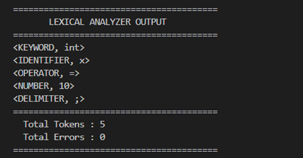
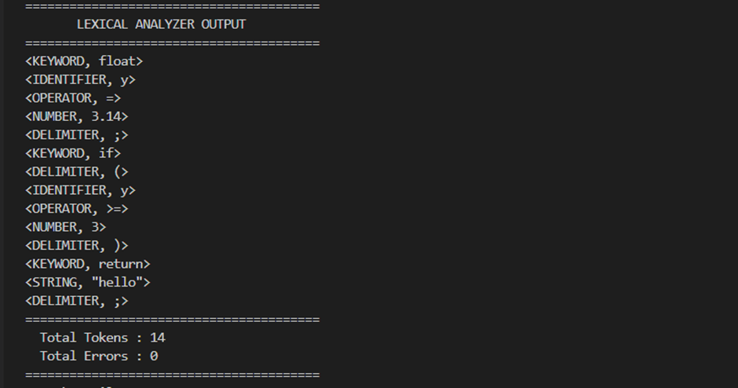
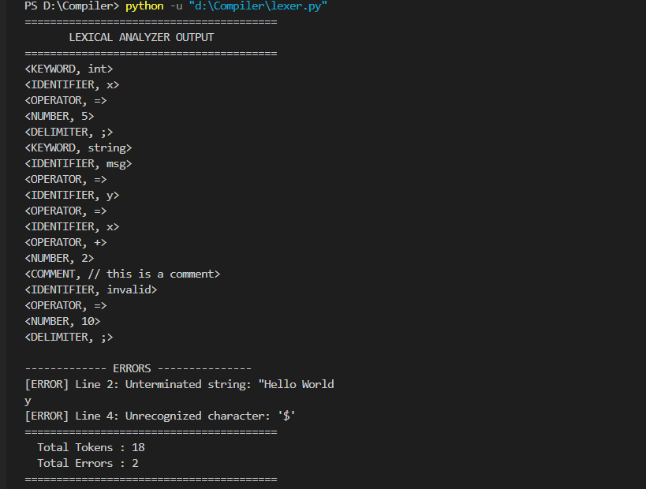

# 🔍 Lexical Analyzer — Compiler Design

A lexical analyzer (scanner) implemented in **Python** for a simplified programming language.  
This is the first stage of a compiler — it reads raw source code and converts it into a stream of meaningful **tokens**.

---

## 📁 Repository Structure

```
lexical-analyzer-compiler-design/
│
├── lexer.py
│
├── diagrams/
│   ├── Transition Diagram.jpg
│   ├── testcase1.png
│   ├── testcase2.png
│   └── testcase3.png
│
└── README.md
```

---

## 📌 What is a Lexical Analyzer?

A **lexical analyzer** (also called a _scanner_) is the first phase of a compiler.  
It reads source code character by character and groups them into meaningful units called **tokens**.

**Example:** For `int x = 10;` the lexer produces:

```
<KEYWORD, int>
<IDENTIFIER, x>
<OPERATOR, =>
<NUMBER, 10>
<DELIMITER, ;>
```

---

## 🧩 Supported Token Types

| Token Type   | Examples                                        | Rule / Pattern                       |
| ------------ | ----------------------------------------------- | ------------------------------------ |
| `KEYWORD`    | `int`, `float`, `if`, `while`                   | Fixed reserved words                 |
| `IDENTIFIER` | `x`, `count`, `myVar`                           | Letter/underscore + letters/digits   |
| `NUMBER`     | `0`, `42`, `3.14`                               | Integer or decimal literal           |
| `STRING`     | `"hello"`                                       | Characters enclosed in double quotes |
| `OPERATOR`   | `+` `-` `*` `/` `=` `==` `!=` `<` `>` `<=` `>=` | Arithmetic and comparison            |
| `DELIMITER`  | `(` `)` `{` `}` `[` `]` `,` `;` `:`             | Punctuation and grouping             |
| `COMMENT`    | `// this is a comment`                          | From `//` to end of line             |

**Keywords:** `int` `float` `if` `else` `while` `return` `void` `char` `bool` `for` `break` `continue` `string`

> Whitespace (spaces, tabs, newlines) is **ignored** between tokens.

---

## 🔄 Transition Diagram


---

## ▶️ How to Run

**Requirements:** Python 3.x (no external libraries needed)

1. Clone the repository:

```bash
git clone https://github.com/shawnazd/lexical-analyzer-compiler-design.git
cd lexical-analyzer-compiler-design
```

2. Create `test.txt` in the same folder as `lexer.py` and write your source code inside.

3. Run:

```bash
python lexer.py
```

---

## 🧪 Test Cases

### Test Case 1 — Basic Declarations

**Input:**

```
int x = 10;
```

**Output:**

```
<KEYWORD, int>
<IDENTIFIER, x>
<OPERATOR, =>
<NUMBER, 10>
<DELIMITER, ;>
```



---

### Test Case 2 — Expressions with String and Operators

**Input:**

```
float y = 3.14;
if (y >= 3) return "hello";
```



---

### Test Case 3 — All Tokens + Error Handling

**Input:**

```
int x = 5;
string msg = "Hello World
y = x + 2 // this is a comment
$invalid = 10;
```

**Errors reported:**

```
[ERROR] Line 2: Unterminated string: "Hello World
[ERROR] Line 4: Unrecognized character: '$'
```



## 👤 Author

**Shawnaz**  
GitHub: [@shawnazd](https://github.com/shawnazd)
